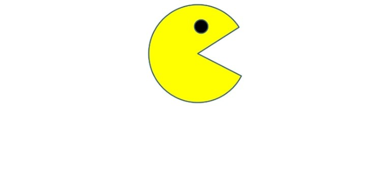

# PacMan-Exercise

## Description
This Exercise is created as a assignment  where packman should go forword from one side of the web page and start to return when it reaches end of the right corner

## How to Run
Fork the repository.
Clone the repository.
Install the dependencies by running npm install.
Run the project using npm start.
Open the project in your browser at http://localhost:3000.

## License
This project is licensed under the MIT License - see the LICENSE file for details.

